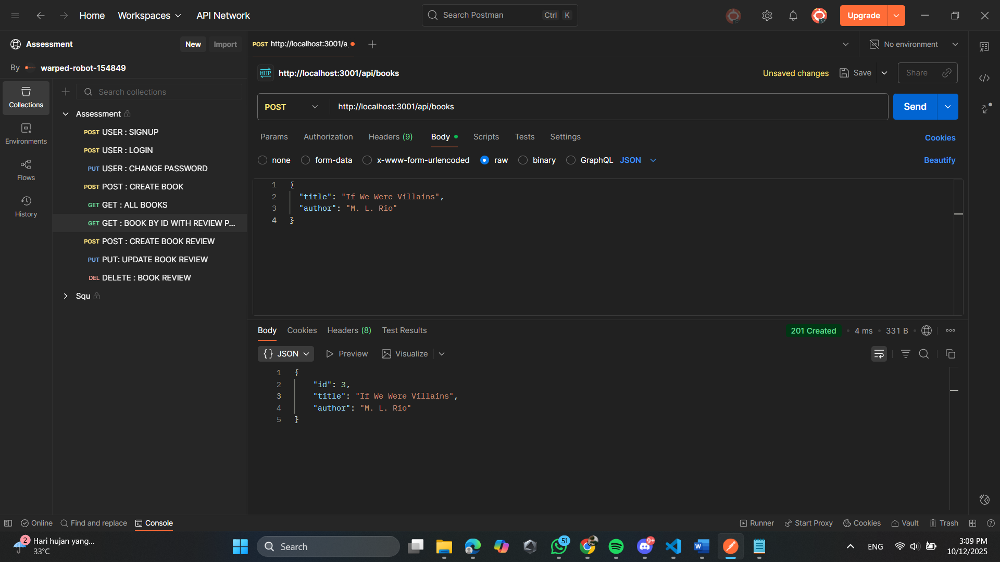
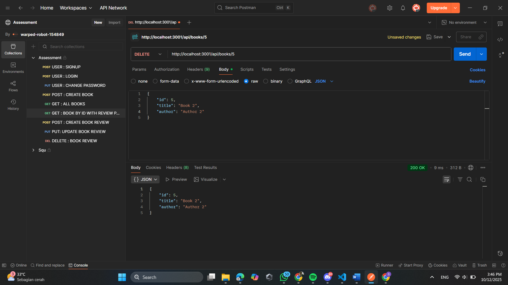
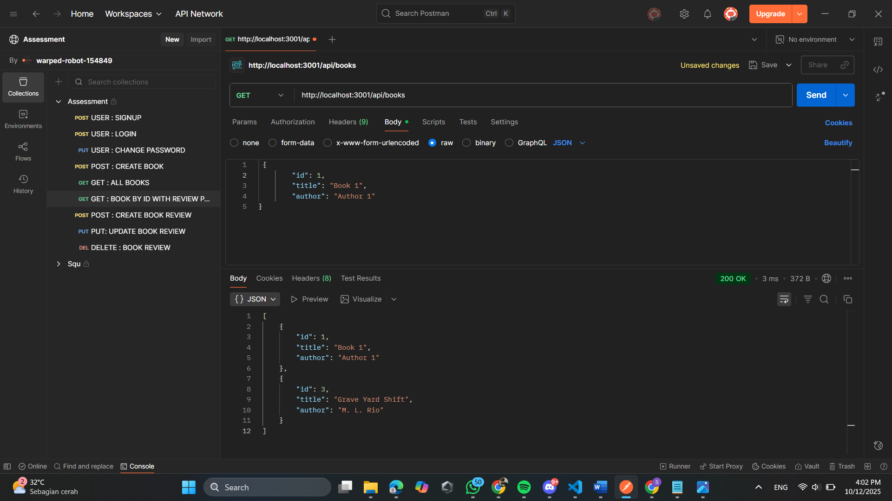

Tugas 2 CRUD Buku

1. Create 
Menambahkan data buku baru ke server dengan metode POST melalui Postman.

2. Update
Mengupdate data buku yang sudah ada di server menggunakan metode PUT di Postman. 

3. Delete
Menghapus data buku dari server menggunakan metode DELETE di Postman.

4. Read
Menampilkan seluruh data buku dari server menggunakan metode GET di Postman. 
