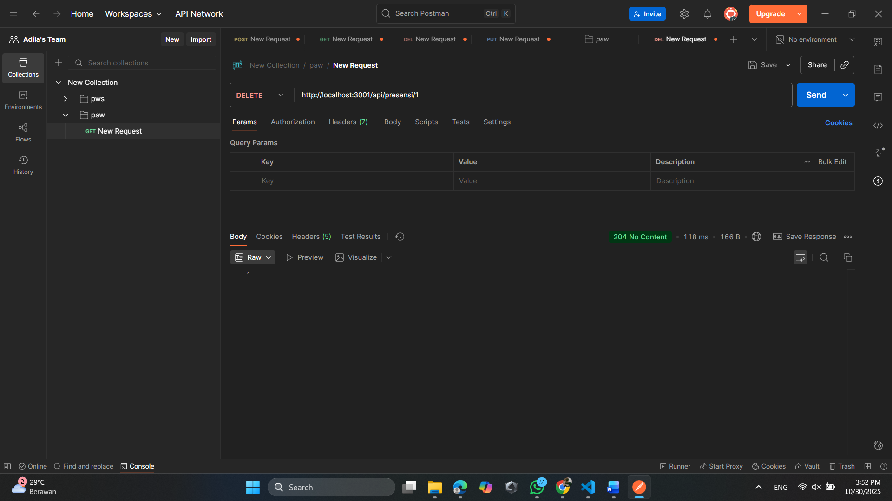
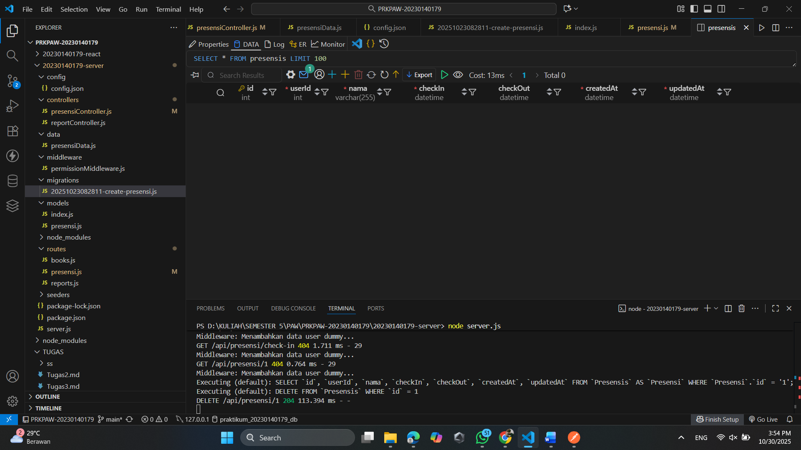
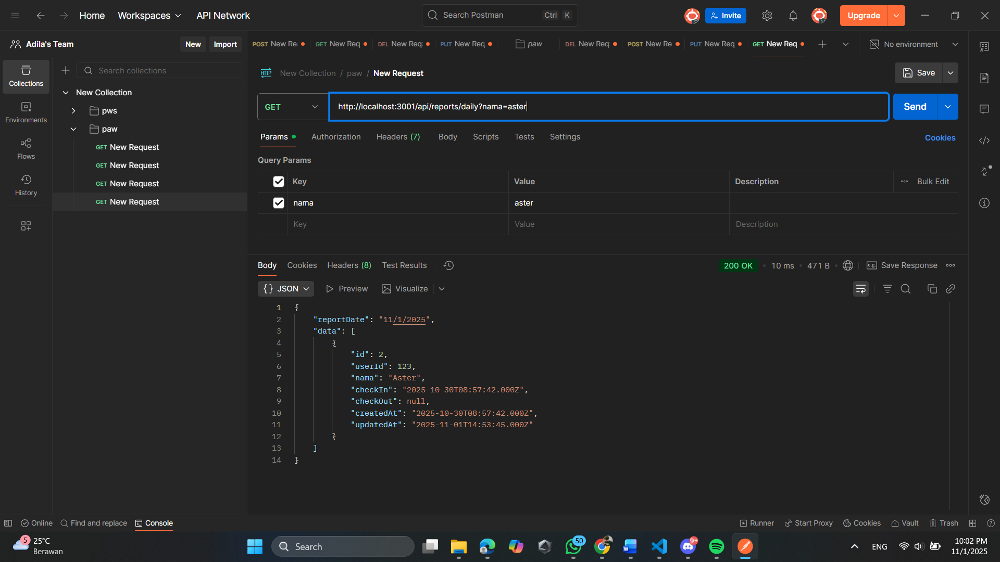
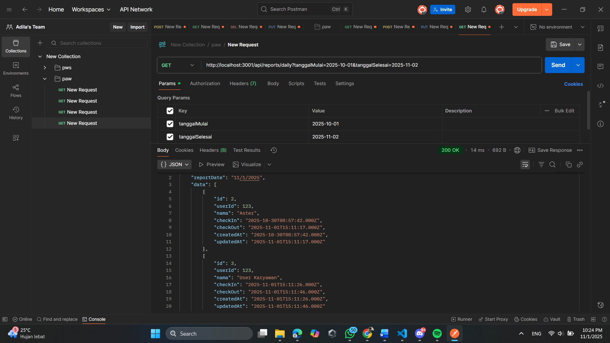

1. Endpoint update data presensi

2. Endpoint update jika format tanggal yang diisi tidak valid

3. Endpoint delete data

4. Enpoint search berdasarkan nama

5. Endpoint search berdasarkan tanggal

